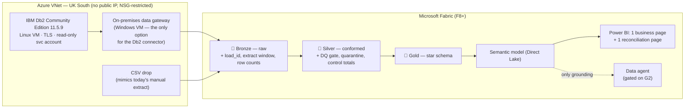

<!--
  Carried over verbatim from the planning session (Rev 4 of the feasibility analysis),
  so follow-up sessions do not have to re-derive the research.
-->

> **Status.** This is the *full* feasibility analysis for the NBKI demo. This repository
> currently implements only the data-seeding portion of it — see [`roadmap.md`](roadmap.md)
> for what remains, and [`dataset-selection.md`](dataset-selection.md) for a deeper treatment
> of §4 (data), which has since been expanded.
>
> Every Microsoft-product claim below was verified against Microsoft Learn at the time of
> writing. Re-verify before putting any of it in front of a customer — Fabric moves quickly.

# NBKI Demo — Proving IBM Db2 → Microsoft Fabric

> **Rev 4.** Scope refocused per your direction: **the demo proves the IBM Db2 → Fabric integration
> pattern.** Equation fidelity is explicitly *out of scope* — it is context for the conversation, not
> the thing being demonstrated. Data selection rewritten around non-Indian datasets. See §8 for history.

---

## 1. Verdict

**Feasible. Build it.** With Equation fidelity out of scope, the risk profile drops sharply — this is
now a well-trodden, fully documented integration path, and most of Rev 2/3's complexity disappears
with it.

| What we prove | What we don't |
|---|---|
| Fabric Data Factory ingests IBM Db2 reliably, on a schedule, with gateway connectivity | That NBKI's specific Equation LPAR is reachable |
| Full load + **watermark incremental**, with control totals and idempotent reruns | Real-time CDC (Fabric has none for Db2) |
| Bronze → silver → gold medallion on genuine banking data at real volume | Equation's physical file/field layouts |
| Direct Lake semantic model, Power BI, and a Fabric data agent over the result | |

### Remaining gates

| Gate | Status |
|---|---|
| **G1** Fabric capacity | ✅ **Paid F8+** — clears the data agent (needs paid F2+). Note the Db2 connector requires an *on-premises* gateway regardless of capacity |
| **G2** Cross-geo AI processing acceptable to NBKI compliance? | ⏳ Open. Gates the **data agent only**. If no, cut it from the live demo — don't discover this mid-presentation. |
| **G3** Audience — IBM i/infra engineers or data/BI/business? | ⏳ Open. Determines how deep to go on connectivity vs. the value story. |

---

## 2. Scope note: Db2 LUW vs. Db2 for i (one slide, then move on)

Db2 Community Edition is **Db2 for LUW**. Equation runs on **Db2 for i** (IBM i / AS400) — a different
product sharing a name and the DRDA protocol. We are **not** claiming otherwise.

**The good news, and the reason this demo is still directly relevant:** the **Microsoft driver** (the
Host Integration Server "ADO.NET Provider for DB2") that Fabric uses speaks DRDA to **LUW, z/OS *and*
IBM i**. So the Fabric-side artefacts — connector, gateway, connection, pipeline, incremental
pattern — are the same shape against either. *(Note: the **IBM .NET driver does not** work with IBM i.
If anyone suggests switching drivers, that's the wrong move.)*

What differs, stated plainly on one slide so nobody has to discover it:

| | Db2 LUW (demo) | Db2 for i (Equation) |
|---|---|---|
| DRDA port | 50000 | **446** clear / **448** TLS |
| Schema model | schema | **library** (`*LIB`) |
| Catalog | `SYSCAT.*` | `QSYS2.SYSTABLES` |
| Package authority | `GRANT BINDADD ON DATABASE` | `WRKOBJ QSYS/CRTSQLPKG` |
| Change capture | watermark / recovery log | **journals + journal receivers** |
| MS-documented versions | LUW 11 / 10.5 / 10.1 | i 7.3 / 7.2 / 7.1 |

**Then pivot to the ask:** a short, separately scoped connectivity spike against a customer-owned
non-production LPAR or reporting replica. That's the natural next step and a clean way to close.

---

## 3. Architecture



### 3.1 Db2 deployment

```
docker pull icr.io/db2_community/db2:11.5.9.0     # pin — never :latest
```
- **Pin 11.5.9.0.** `latest` = 12.1.5.0, which is (a) **outside the connector's documented LUW support
  list** (11 / 10.5 / 10.1) and (b) on the 12.1.4+ "AI Community Edition" line licensed to **one CPU**.
  11.5.9 also gives 16 GB instance memory vs 12.1's 8 GB.
- **Licence:** free, 4 cores, no documented DB size cap, **non-production only** (`db2dec.lic`). Say so.
- **Security:** no public IP; NSG restricted to the gateway subnet; TLS via `ssl_svcename` +
  `DB2COMM=TCPIP,SSL`; Fabric connects as a **dedicated least-privileged read-only account, not
  `db2inst1`** (use that only for the one-off package bind). Credentials in Key Vault.
- **VM:** D4s_v5 (4 vCPU / 16 GB) matches the CE cap. Auto-shutdown schedule. Premium SSD.

### 3.2 Gateway

The connector **requires a gateway regardless** — Microsoft is explicit: *"You must select an
on-premises data gateway for this connector, whether the IBM Db2 database is on your local network or
online."*

**Use an on-premises data gateway on a Windows VM.** There is no alternative: the
capability matrix marks Dataflow Gen2, Copy activity, Lookup *and* Copy job as
**On-premises**, so a VNet data gateway cannot serve this connector at all.

> An earlier revision of this document recommended the VNet data gateway as a
> "demo convenience", which directly contradicted the quotation immediately
> above it. That was wrong and is corrected here — the gateway VM is a real work
> item, not a checkbox. See `docs/roadmap.md`, Phase 2.

> Networking is friendly: the gateway needs **no inbound ports** from the
> internet. Keep Db2 and the gateway in the same VNet so the database port never
> leaves it.

### 3.3 Pre-empt the `-805` package trap

The Microsoft provider needs a DRDA package. On LUW it auto-creates `NULLID.MSCS001` (LUW users have
BINDADD by default; `-805` is mainly a z/OS and IBM i problem). To be deterministic:
1. Bind once as an admin identity.
2. Set `packageCollection=NULLID` **explicitly**. *Power Query defaults to `NULLID`; the pipeline
   linked service defaults to `{username}` — that inconsistency is exactly how you get a working
   dataflow and a failing pipeline.*
3. Verify: `SELECT PKGSCHEMA, PKGNAME FROM SYSCAT.PACKAGES WHERE PKGNAME LIKE 'MSCS%'`
4. Failure signature to recognise live: `SQLSTATE=51002 SQLCODE=-805`.

---

## 4. Data — non-Indian, relational, clean licence

Searched Kaggle across six query sets. The overwhelming majority of "banking" datasets are
**single-table ML training sets** (churn, fraud scoring) — useless for a medallion demo. Only a handful
are genuinely relational. Two clear winners, and they complement each other.

### 4.1 ⭐ Primary — `computingvictor/transactions-fraud-datasets`

**`https://www.kaggle.com/datasets/computingvictor/transactions-fraud-datasets`**
**Apache 2.0** · 1.4 GB · 370 votes · 54,000 downloads · **US-based, 2009–2019**

Columns verified from `microsoft/databricks-mlops-workshop`:

| File | Grain | Key columns |
|---|---|---|
| `users_data.csv` | one row per client | `id`, `current_age`, `yearly_income`, `total_debt`, **`credit_score`**, `num_credit_cards` |
| `cards_data.csv` | one row per card | `id`, `client_id`, `card_brand`, `card_type`, **`credit_limit`**, `num_cards_issued` |
| `transactions_data.csv` | one row per transaction (**~13M**) | `id`, `client_id`, `card_id`, `amount`, `date`, **`mcc`**, `use_chip`, `merchant_state` |
| `mcc_codes.json` | lookup | `mcc` → description |
| `train_fraud_labels.json` | labels | fraud flag per transaction |

**Why this one:**
- **Apache 2.0** — the cleanest licence of anything found. No share-alike, no NonCommercial. Safe to
  hand a bank.
- **Not Indian.** US geography, USD, neutral for a UK/Gulf audience.
- **Genuinely relational** — a real `users → cards → transactions` FK chain, which is what the medallion
  needs. Most Kaggle banking data is one flat table.
- **Already validated as a database-demo dataset**: `microsoft/databricks-mlops-workshop` uses it, and
  Google Cloud's `training-data-analyst` uses it for an **AlloyDB "AI agents with databases"** course.
  If it works as a relational demo corpus for AlloyDB, it works for Db2 — and that's a useful
  credibility note.
- Lineage: built by **CaixaBank Tech** for their 2024 AI Hackathon, descended from IBM/Altman's
  synthetic generator. Real banking pedigree.
- `mcc` + `merchant_state` + `credit_score` + `total_debt` → a credible gold layer: customer 360,
  spend analytics, credit exposure, fraud.

### 4.2 ⭐ Scale partner — `ealtman2019/ibm-transactions-for-anti-money-laundering-aml`

**`https://www.kaggle.com/datasets/ealtman2019/ibm-transactions-for-anti-money-laundering-aml`**
**IBM Research (Erik Altman)** · CDLA-Sharing-1.0 · 41.6 GB total · 272 votes · NeurIPS 2023 paper
(`arxiv.org/abs/2306.16424`)

Columns verified: `Timestamp, From Bank, Account, To Bank, Account.1, Amount Received, Receiving
Currency, Amount Paid, Payment Currency, Payment Format, Is Laundering`

**Six pre-sized variants** — ideal for a tiered "prove Db2 at scale" story:

| Variant | Transactions | Bank accounts | Days |
|---|---:|---:|---:|
| HI-Small / LI-Small | 5M / 7M | 515K / 705K | 10 |
| HI-Medium / LI-Medium | 32M / 31M | 2,077K / 2,028K | 16 |
| HI-Large / LI-Large | 180M / 176M | 2,116K / 2,064K | 97 |

**Why it earns a place:**
- 🎯 **It is IBM's own data, running on IBM Db2.** Nice narrative symmetry, and unimpeachable provenance.
- **No country localisation at all** — a synthetic virtual world. Sidesteps the whole "why is this
  Indian?" problem rather than papering over it.
- **Multi-currency and multi-bank**, with payment formats (ACH, cheque, wire, credit card, bitcoin) —
  far closer to an international bank like NBKI than domestic retail data.
- **True `Timestamp` column**, not just a date → a *real* watermark incremental with no mass ties.
  This directly fixes the watermark weakness flagged in earlier revisions.
- **Sized variants let you dial volume to the story**: build on Small (5M), then show Medium (32M) to
  demonstrate genuine Db2 extraction throughput. That is exactly "proving IBM Db2."
- **AML/financial crime is board-level relevant** for a UK-regulated Kuwaiti bank subsidiary — a much
  stronger business hook than branch-performance reporting.

**Caveats:** essentially one wide transaction table (bank and account dimensions must be *derived* —
which is a legitimate silver-layer exercise, not a flaw). **CDLA-Sharing-1.0** is a share-alike-style
data licence: fine for internal demo use, note it if artefacts are handed to the customer.

### 4.3 How to combine them

| Layer | Source |
|---|---|
| **Customer / card / retail spend** — customer 360, MCC spend, credit exposure, fraud | `computingvictor` (Apache 2.0) |
| **Payments volume & throughput** — multi-currency, multi-bank, AML | `ealtman2019` sized variant |
| **Watermark incremental** | `ealtman2019` `Timestamp`; add `LAST_UPDATED_TS` to both on load |
| **CSV drop path** | a slice of either, shaped like NBKI's current manual extract |

Load both as-is. **No data generator required** — that whole workstream from Rev 2/3 is now cut. Add
only two things at load time: a `LAST_UPDATED_TS` watermark column and a small controlled delta batch
containing deliberate bad rows for the DQ demo.

### 4.4 Considered and rejected

| Dataset | Verdict |
|---|---|
| `vivekmali1436/banking-transactions-dataset` ("BankCorp") | ↩️ **Dropped.** Nice 10-table schema, but **Indian** (₹, IFSC codes, Kochi/Bhopal/Maharashtra), **CC BY-SA share-alike**, no licence on its repo, `DATE` not `TIMESTAMP`, and balances don't reconcile. Keep only its DDL as a schema reference if a richer model is ever wanted. |
| `shivamb/bank-customer-segmentation` | ❌ **Indian** (1M+ txns, 800K customers, India). Licence "Data files © Original Authors" — unclear. |
| PKDD'99 Berka | ❌ Tiny (4,500 accounts), 1993–98, Czech koruna. Only merit was running balances — no longer needed. |
| `demodatauk/full-banking-transaction-log-sample` | ❌ UK and CC0, but the Kaggle file is a **0 MB teaser** for a paid commercial product. |
| BankSim | ⛔ CC BY-**NC**-SA — NonCommercial. Unusable commercially. |
| PaySim | ⚠️ CC BY-SA; single flat table, no customer master. |
| IBM TabFormer | Superseded by 4.1/4.2 — same lineage, worse packaging (git-lfs pointers). |
| `nethajisubash/ibmi-banking-simulation` | ❌ 6 toy tables. Steal only the *narrative*: payment → screening → GL → SWIFT → EOD → audit. |

### 4.5 Licensing position

Apache 2.0 on the primary dataset means **no share-alike exposure on the main payload** — the key
reason it's ranked first. CDLA-Sharing-1.0 on the IBM AML data is acceptable for internal demo use;
flag it if demo artefacts are handed over. Retain attribution for both. Both are **fully synthetic** —
no real PII, which is the right answer for a bank demo.

---

## 5. What to actually show

NBKI's pain is **manual CSV extraction: slow, error-prone, unauditable, no single version of truth.**
Lead with trust, not architecture.

| Their pain | Demonstrate |
|---|---|
| Manual | Scheduled pipeline; incremental run; exactly which records moved |
| Error-prone | **Source vs. landed row counts and monetary control totals**; quarantined records; corrected reprocessing |
| Unauditable | `load_id`, extraction window, pipeline run ID on every bronze row; lineage |
| Untrustworthy | **Idempotent rerun** — run it twice, show zero duplicates |
| Slow | Throughput on a Medium-sized load — real Db2 extraction at scale |
| No single truth | One Direct Lake semantic model; identical numbers in report, Excel and agent |

> Pre-seed the **bad delta batch** rather than mutating the source live. Control totals and
> reconciliation are what banking operations actually care about; live source-mutation theatre is
> fragile and proves only that an obviously invalid row can be rejected.

### The CSV-drop insurance path

Keep the **second bronze path that reads a CSV drop shaped like today's manual extract.** Half a day of
work, and it means the value story survives even if direct Equation access later turns out to be
blocked — the answer becomes *"then we automate your existing extract on day one."* Turns an
unanswerable objection into a phased roadmap.

### Change capture — be precise

Fabric Copy job supports **watermark incremental** for Db2. Db2 is **absent from Fabric's CDC connector
list**, and there is **no native Fabric Mirroring for Db2** (partner open mirroring only). Db2 LUW has
no SQL Server-style change tracking, and IBM excludes CDC/Q-Replication from **every** Db2 edition —
IBM Data Replication is separately licensed. Present three production patterns: **watermark** (where a
reliable change field exists), **reconciled snapshot/diff** (where it doesn't), and **journal-based
replication** (near-real-time, separately licensed). Never imply the third is a config toggle.

---

## 6. Regulated-bank readiness

Both datasets are **synthetic** — state that explicitly and early; it removes most of the objection
surface. Beyond that: TLS source→gateway; no public IP; NSG restriction; dedicated read-only service
account; Key Vault secrets; package-binding authority separated from runtime access; Fabric workspace
roles and least privilege; one sensitivity label; RLS/OLS verified consistently **across Power BI,
Excel and the data agent**; audit-log retention.

⚠️ The data agent's **cross-geo processing/storing for AI** tenant settings are **G2 — a go/no-go
decision**, not a footnote. Settle it before the demo.

---

## 7. Scope

### MVP

1. **Source** — Db2 CE loaded with `computingvictor` (3 tables + MCC lookup) and one `ealtman2019`
   sized variant. Plus the CSV drop path.
2. **Ingestion** — one full load, one watermark incremental; `load_id`, extract timestamps, row counts,
   monetary control totals; **demonstrated rerun safety**.
3. **Transformation** — bronze raw landing; silver conformed + **two meaningful DQ rules**; one gold
   star schema.
4. **Consumption** — one Power BI page answering a real business question, one reconciliation page.
   Data agent grounded **only on the semantic model** (not gold tables directly — otherwise it bypasses
   governed measures and contradicts "same numbers everywhere"). Gated on G2.
5. **Governance** — lineage, one sensitivity label, one access-control example.
6. **Close** — the one-slide Db2-for-i delta (§2) and the proposed IBM i spike.

**~12-minute storyline:** today's manual process and its control weaknesses → trigger an incremental
load → show exactly which records moved and the control totals → show the quarantined bad batch and its
correction → rerun to prove idempotency → one governed report → "here's what changes for Equation."

### P0 spike — before anything else

Db2 CE on the VM → on-premises data gateway → one Fabric pipeline reads one Db2 table **over TLS, as the
least-privileged account, with a correct incremental second run.** Not merely "a table can be read."
Nothing else starts until this passes.

### Explicitly cut vs. earlier revisions

Synthetic data generator · re-localisation work · balance-reconciliation repair · Finastra vocabulary
schema mapping · IBM i cosmetic realism (10-char names, CYYMMDD dates) · GL double-entry construction ·
dispositions model. **All of it existed to serve Equation fidelity, which is now out of scope.**

---

## 8. Revision history

**Rev 4 (this one) — scope refocused on proving Db2; data reselected**
- Demo repositioned: **prove the Db2 → Fabric pattern**, Equation fidelity explicitly out of scope
- §2 shrunk from the centrepiece to a single closing slide
- **Primary dataset → `computingvictor/transactions-fraud-datasets`** (Apache 2.0, US, relational
  `users→cards→transactions`, ~13M rows; columns verified; already used by Microsoft and Google as a
  database-demo corpus)
- **Scale partner → `ealtman2019/ibm-transactions-for-anti-money-laundering-aml`** (IBM's own data,
  6 sized variants to 180M rows, multi-currency, true `Timestamp`, no country localisation)
- **BankCorp dropped** — Indian (₹/IFSC), CC BY-SA, DATE-only, non-reconciling balances
- **Berka dropped** — tiny, 1993–98, its one advantage no longer needed
- **Entire data-generator workstream cut** — load as-is
- Watermark weakness resolved for free by the AML dataset's real timestamps

**Rev 3** — adopted BankCorp as schema template; flagged its Indian localisation and share-alike licence.

**Rev 2** — post-review corrections: verdict downgraded; LUW-vs-i treated as an evidence gap; CSV-drop
path added; watermark demoted to one of three patterns; security expanded; **withdrew an unsafe
"regeneration strips licences" claim**; fixed CYYMMDD (7 digits, not 8) and a bronze-naming
contradiction; volume cut.

**Rev 1** — initial analysis.
